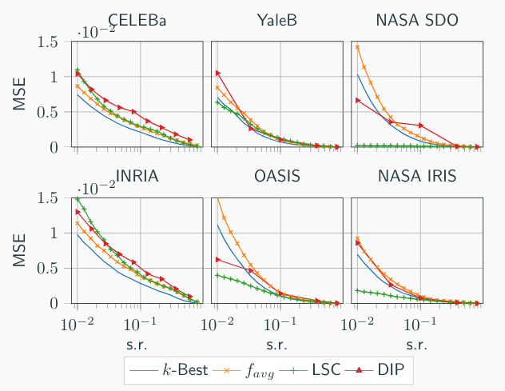

# Learnable Compressive Subsampling with Priors

**Author**: Martino Ferrari   
**Contact**: manda.mgf@gmail.com

## Presentation

My master thesis work extends the problem formulation of learnable compressive subsampling [^1] that focuses on the learning of the best sampling operator in the Fourier domain adapted to spectral properties of a training set of images. I formulated the problem as a reconstruction from a finite number of sparse samples with a prior learned from the external dataset or learned on-fly from the images to be reconstructed. More in 
details, I developed two very different methods, one using multiband coding in the spectral domain and the second using a neural network based on [Deep Image Prior](https://dmitryulyanov.github.io/deep_image_prior) [^2]. 

The new methods can be applied to many different fields of spectroscopy and Fourier optics, for example in medical (computerized tomography, magnetic resonance spectroscopy) and astronomy (the Square Kilometre Array) imaging, where the capability to reconstruct high-quality images, in the pixel domain, from a limited number of samples, in the frequency domain, is a key issue. 

The proposed methods have been tested on diverse datasets covering facial images, medical and multi-band astronomical data, using the mean square error and SSIM as a perceptual measure of the quality of the reconstruction. 

Finally, I explored the possible application in data acquisition systems such as computer tomography and radio astronomy. The obtained results demonstrate that the properties of the proposed methods have a very promising potential for future research and extensions. 

For such reason, the work was both presented at EUSIPCO 2018 conference [^3] ([pdf](http://sip.unige.ch/articles/2018/EUSIPCO2018_TaranO.pdf)) in Rome and submitted for an EU patent. 

A presentation is also available one SlideShare: [link](https://www.slideshare.net/MartinoGiordanoFerra/injecting-image-priors-into-learnable-compressive-subsampling)

## Results

Some graphical and analytic results are shown below: 



The MSE and SSIM measured for different dataset at different sampling rate using the following sub-sampling methods: LSC, DIP [2], f_avg [1] and k-best (not practical).


Example of reconstruction for different dataset using different acquisition methods: LSC, DIP [2], f_avg [1] and k-best (not practical). 

More raw results can be found in the `results` folder and other can be created by running the different scripts.

## See it in action

If you are interested in testing, using or improving the algorithms check it out [here](https://github.com/Mandarancio/LSC-DIP) or using `git`:
```
git clone https://github.com/Mandarancio/LSC-DIP.git
```

The code is written in `python 3` and few `notebook`s are provided with step-by-step documentation, also a `YAML` configurable script is available  for batch analysis.

## Bibliography

[^1]: L. Baldassarre, Y.-H. Li, J. Scarlett, B. Gözcü, I. Bogunovic, and V. Cevher, “Learning-based compressive subsampling,” IEEE Journal of Selected Topics in Signal Processing, vol. 10, no. 4, pp. 809–822, 2016

[^2]: D. Ulyanov, A. Vedaldi, and V. Lempitsky, “Deep image prior,” arXiv preprint arXiv:1711.10925, 2017.

[^3]: M. Ferrari, O. Taran, T. Holotyak, K. Egiazarian, and S. Voloshynovskiy, "Injecting Image Priors into Learnable Compressive Subsampling," in Proc. 26th European Signal Processing Conference (EUSIPCO), Rome, Italy, 2018
 
